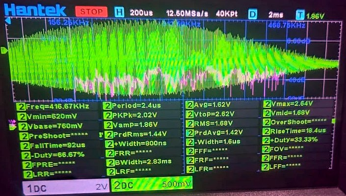
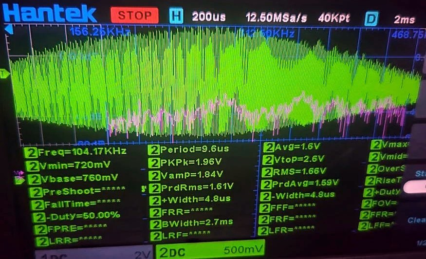
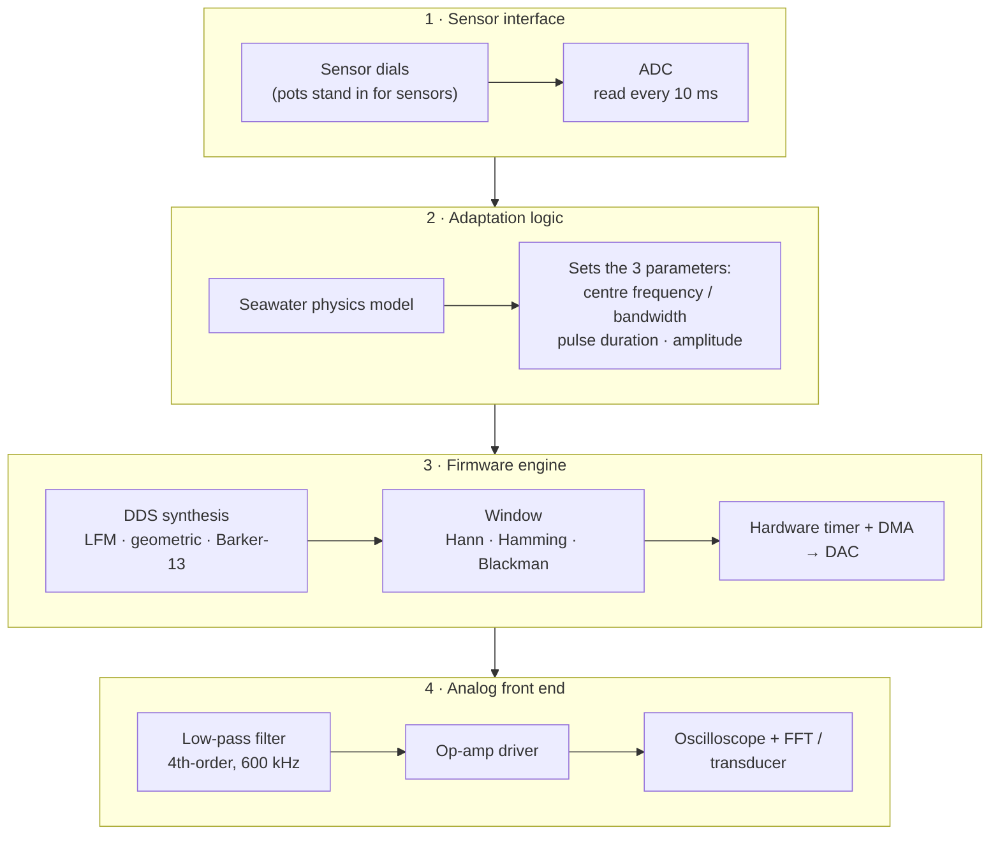
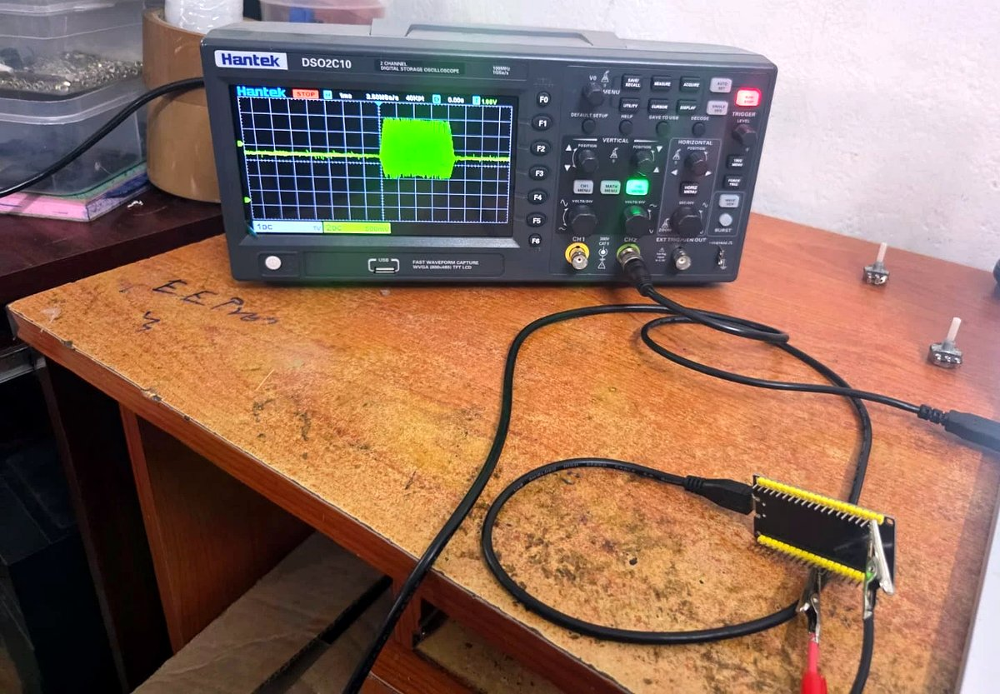
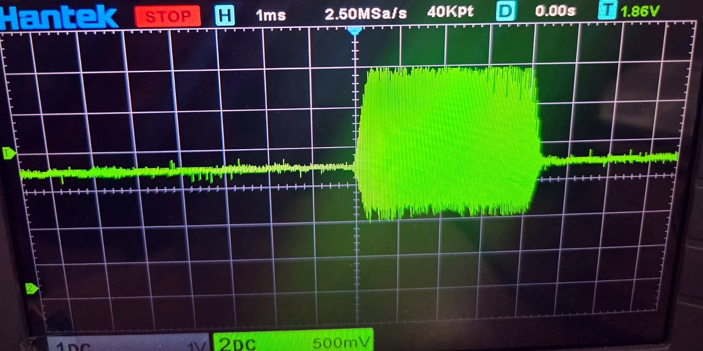
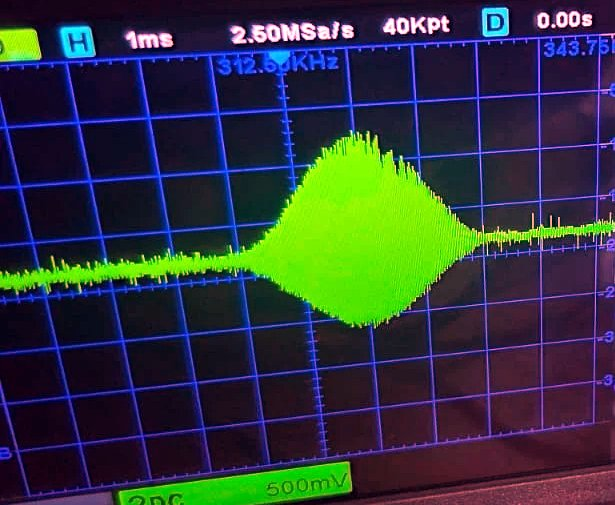
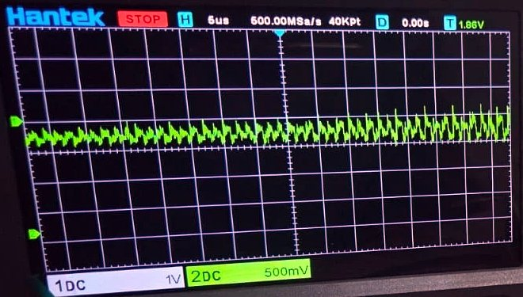
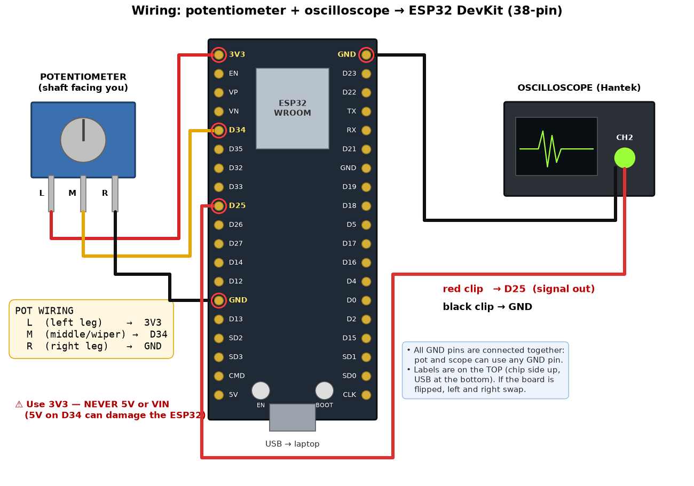

# Adaptive Sonar Payload

**A low-power, real-time adaptive, software-defined sonar transmitter for Autonomous Underwater Vehicles (AUVs).**

Smart India Hackathon 2026 · Problem Statement **SIH26058** (Ministry of Earth Sciences / NIOT) ·
Category: Hardware · Theme: Robotics and Drones · Team **Lightning Logics**

| 🎥 Demo video | 🧊 3D model design | 💻 Source code |
|---|---|---|
| [youtu.be/wdHIg8nZBoI](https://youtu.be/wdHIg8nZBoI) | [lightninglogics.me](https://www.lightninglogics.me/) | [Surjune/Lightning-Logics-Hardware](https://github.com/Surjune/Lightning-Logics-Hardware) |

### The result in one picture

One turn of the "turbidity" dial, measured on a Hantek DSO2C10 oscilloscope at the transmitter's
DAC output. The payload moves its ping from a sharp high-frequency chirp for clear water to a
low-frequency chirp that cuts through mud, without any manual re-tuning.

| Clear water: ping measured at **416.7 kHz** | Muddy water: ping measured at **104.2 kHz** |
|:---:|:---:|
|  |  |
| design band 389–486 kHz | design band 100–140 kHz |

---

## Contents

1. [Summary](#1-summary)
2. [The problem](#2-the-problem)
3. [The solution at a glance](#3-the-solution-at-a-glance)
4. [Problem-statement checklist](#4-problem-statement-checklist)
5. [Evidence: measured on the oscilloscope](#5-evidence-measured-on-the-oscilloscope)
6. [How it works](#6-how-it-works)
7. [Platform: STM32 target, ESP32 prototype](#7-platform-stm32-target-esp32-prototype)
8. [Reproduce the demo](#8-reproduce-the-demo)
9. [Repository layout](#9-repository-layout)
10. [Verification and tools](#10-verification-and-tools)
11. [Status and roadmap](#11-status-and-roadmap)
12. [Troubleshooting](#12-troubleshooting)
13. [Glossary](#13-glossary)
14. [References](#14-references)

---

## 1. Summary

* **What:** a self-contained sonar transmitter payload that senses the water and re-shapes its
  acoustic "ping" in real time, like a Software-Defined Radio: one piece of hardware, with the
  waveform defined in software.
* **How:** sensor inputs are read by the ADC. A seawater physics model sets the three wave
  parameters the problem statement names: **centre frequency / bandwidth, pulse duration and
  amplitude**. The C/C++ firmware synthesises **LFM chirps, geometric sweeps or Barker-13
  phase-coded pulses** and streams them to the DAC with a **hardware timer and DMA**, so the CPU
  never stalls. **Hann / Hamming / Blackman windows** and an **op-amp low-pass filter** give a
  smooth, protected analog output.
* **Proof:** a working prototype, measured on an oscilloscope. Turning the dial moves the ping
  from **416.7 kHz to 104.2 kHz** (section 5), with **0 DMA underruns**.
* **Platform:** designed for **STM32**, prototyped and tested on an **ESP32** (section 7).

## 2. The problem

Side-scan sonar on an AUV sends short sound pulses ("pings") and listens for echoes to image the
seabed. The best ping depends on the water, and the water changes during a mission:

| Ping | Strength | Weakness |
|---|---|---|
| **High frequency** (around 500 kHz) | sharp, high-resolution images | absorbed quickly, especially in muddy or deep water |
| **Low frequency** (around 100 kHz) | travels far through murky water | blurry, low-resolution images |

A conventional transmitter uses **one fixed ping everywhere**. The problem statement asks for a
transmitter that adapts its physical analog waveform to depth, turbidity, temperature and
salinity in real time, built as real hardware with DMA and hardware timers so that it does not
drain the AUV's battery.

## 3. The solution at a glance

The design follows the four modules of the problem statement's *Expected Solution*:



How the three critical wave parameters are chosen:

| Parameter (problem statement) | What the payload does |
|---|---|
| **1. Bandwidth / centre frequency** (range vs resolution) | picks the **highest band the water allows** over the required range: 400–500 kHz in clear water, down to 100–140 kHz in mud |
| **2. Pulse duration** (total energy) | lengthens the pulse (1–5 ms) only when the range needs more energy, and keeps it short enough to limit the blind zone |
| **3. Amplitude / signal power** | raises the amplitude (0.5–1.0 of full scale) only after the pulse length is used up |

**Key idea:** the ping follows the water. It's chosen by physics, not by a fixed table.

## 4. Problem-statement checklist

✅ done and measured · 🟡 designed, build pending · ⏳ planned

| Problem-statement requirement | How it is met | Evidence | Status |
|---|---|---|---|
| Physical hardware on an embedded platform (STM32, ESP32, DSP or FPGA) | ESP32 prototype; STM32 is the target platform | [Section 7](#7-platform-stm32-target-esp32-prototype), bench photo in [section 5](#5-evidence-measured-on-the-oscilloscope) | ✅ prototype |
| Firmware in C/C++ | 4 modules, about 1,500 lines | [`firmware/sonar_tx/`](firmware/sonar_tx/) | ✅ |
| Hardware timers + DMA stream the waveform to the DAC without stalling the CPU | I2S clock + DMA ring at 2 MSPS; the CPU only refills a buffer once per ms | [`dac_stream.cpp`](firmware/sonar_tx/dac_stream.cpp); 0 underruns measured | ✅ |
| LFM chirps, geometric sweeps and phase-coded pulses, on the fly | Direct digital synthesis; switched by the BOOT button or the `MOD` command between pings | [`pulse.cpp`](firmware/sonar_tx/pulse.cpp) | ✅ |
| Environment input via sensors or potentiometers, read by an ADC | Pots simulate turbidity, range, temperature, salinity and depth ("Entering Muddy Estuary" ↔ "Entering Clear Shallow Reef") | [Pot sweep log](#53-the-dial-sweep-recorded-from-the-board) | ✅ |
| Modify **bandwidth / centre frequency** instantly | Physics model picks the band; a new pulse is ready within 33 ms | **416.7 kHz ↔ 104.2 kHz** on the scope | ✅ |
| Modify **pulse duration** (energy) | 1.55 ms (clear, short range) to 5.00 ms (muddy, long range) | [Board log](#53-the-dial-sweep-recorded-from-the-board) | ✅ |
| Modify **amplitude / signal power** | 0.50 → 1.00 of full scale as the range demands | [Board log](#53-the-dial-sweep-recorded-from-the-board) | ✅ |
| Digital windows (Hamming, Hann, Blackman) | Also Tukey and rectangular; chosen automatically or by command | Ramp-up photo in [section 5](#5-evidence-measured-on-the-oscilloscope) | ✅ |
| Active / passive low-pass filter and operational amplifier | Buffer + two Sallen-Key stages (4th-order Butterworth, 600 kHz) + AC-coupled driver | [`hardware/`](hardware/): schematic, BOM, simulated response | 🟡 |
| Output on an oscilloscope; clean, low-distortion spectrum via FFT | Waveform shape, frequency and burst width measured on a Hantek DSO2C10; the filter board is what gives the fully clean spectrum | [Section 5](#5-evidence-measured-on-the-oscilloscope) | ✅ / 🟡 |
| Low-power design | DMA + lookup tables leave the CPU idle; pulse energy only as high as the water needs | [Section 6.4](#64-stream-dma-and-a-hardware-clock) | ✅ design · ⏳ current measurement |
| 3D-printed / fabricated enclosure for an AUV hull slot | Payload-pod design | [lightninglogics.me](https://www.lightninglogics.me/) | 🟡 |

---

## 5. Evidence: measured on the oscilloscope

All captures are from the prototype's DAC output (ESP32 GPIO25), probed directly with a
**Hantek DSO2C10** (100 MHz, 1 GSa/s). The dial is a 10 kΩ potentiometer on the ADC input.

### 5.1 Test bench



ESP32 board (USB-powered) with the scope probe on the DAC pin, potentiometers as the
environment sensors, and the oscilloscope showing a ping.

### 5.2 Captures

| | |
|:---:|:---:|
|  |  |
| **Clear water, whole ping** (1 ms/div). A 4.2 ms burst with short tapered edges: the firmware chose a **Tukey** window | **Muddy water, whole ping** (1 ms/div). A rounder envelope: the firmware switched to a **Hann** window by itself |
|  |  |
| **Clear water, inside the ping** (200 µs/div, 2 ms after the trigger). Freq **416.67 kHz**, period 2.4 µs | **Muddy water, inside the ping** (same settings). Freq **104.17 kHz**, period 9.6 µs |
|  | |
| **Start of a ping** (5 µs/div). The amplitude ramps up smoothly instead of jumping: the window protects the transmitter from voltage steps and cuts sidelobes | |

### 5.3 The dial sweep, recorded from the board

The firmware logs every decision over USB. These lines were captured while the dial was turned
from clear to muddy water (range held at 60 m):

| Dial (turbidity) | Ping chosen by the payload |
|---|---|
| 0 NTU | LFM **388.6–486.4 kHz**, 4.51 ms, Tukey window |
| 2 NTU | LFM 363.6–456.4 kHz, 4.50 ms, Tukey |
| 68 NTU | LFM 125.0–170.0 kHz, 4.34 ms, Hann |
| 76 NTU | LFM 115.9–159.1 kHz, 4.32 ms, Hann |
| 84 NTU | LFM 109.1–150.9 kHz, 4.32 ms, Hann |
| 92 NTU | LFM 102.3–142.7 kHz, 4.30 ms, Hann |
| 100 NTU | LFM **100.0–140.0 kHz**, 4.36 ms, Hann |

Range and power change the **duration and amplitude**. This is the board's own reply to the
"muddy estuary, long range" setting:

```
> ENV turbidity=100 range=200
OK
# ENV 100 NTU, 200 m, 25.0 C, 35.0 PSU, 10 m deep -> lfm 100.0-140.0 kHz, 5.00 ms, amp 1.00, tukey, PRI 325.8 ms | res 1.9 cm | range-limited | synth 8.20 ms
```

Compared with a clear, 12 m reef (LFM 400–500 kHz, **1.55 ms**, amplitude **0.50**), all three
parameters have changed.

### 5.4 Measured vs designed

| Quantity | Designed (firmware) | Measured (Hantek DSO2C10) |
|---|---|---|
| Clear-water frequency | 389 → 486 kHz chirp | **416.7 kHz** at 2 ms into the ping |
| Muddy-water frequency | 100 → 140 kHz chirp | **104.2 kHz** at 2 ms into the ping |
| Burst width (clear, 60 m) | 4.51 ms | 4.23 ms (the faint tapered ends fall below the scope's threshold) |
| Centre level | 1.65 V (DAC mid-scale) | 1.64 V average |
| Amplitude 0.50 | about 1.6 V peak-to-peak | 1.9–2.0 V p-p, including the DAC's step edges |
| DMA underruns while re-tuning | 0 | 0 (firmware counter) |

A chirp's frequency rises through the pulse, so the reading depends on where in the pulse it is
taken. Both readings were taken at the same point, 2 ms after the trigger. The small spikes on
the raw DAC output are the 8-bit DAC's steps; the analog low-pass filter in
[`hardware/`](hardware/) removes them.

---

## 6. How it works

### 6.1 Sense

Potentiometers stand in for sensors, as the problem statement allows. Each gives 0–3.3 V on an
ADC pin, read every 10 ms and scaled to a physical value:

| Input | Pin (ESP32) | Range | Enabled by default |
|---|---|---|---|
| Turbidity | G34 | 0–100 NTU | yes |
| Required range | G35 | 5–200 m (log scale) | no (fixed at 60 m) |
| Temperature | G32 | 0–35 °C | no (25 °C) |
| Salinity | G33 | 0–40 PSU | no (35 PSU) |
| Depth | G36 (SP) | 0–300 m | no (10 m) |

Inputs that aren't wired use a default value, or a value set over USB with `ENV`, for example
`ENV temp=10 salinity=35`.

### 6.2 Decide: the seawater physics model

* **Sound speed:** Mackenzie (1981) equation from temperature, salinity and depth.
* **Absorption:** Francois–Garrison (1982) seawater absorption, plus a sediment term for
  suspended mud.
* **Band:** the highest centre frequency (120–450 kHz) whose two-way absorption over the
  required range stays within budget. The bandwidth grows with the centre frequency.
* **Energy:** the pulse length grows first (1–5 ms, with the blind zone kept at 10 % of the range
  or less), then the amplitude (0.5–1.0).
* **Modulation and window:** LFM by default; Barker-13 when very short range forces a pulse
  under 1 ms. The window is a smooth **Hann** when energy is spare and **Tukey** when the range
  needs the energy.
* **Ping interval:** long enough for the echo to return before the next ping (at least 20 ms).

Decisions for typical water (25 °C seawater):

| Water | Range | Ping chosen | Ping interval | Range resolution |
|---|---|---|---|---|
| Clear | 12 m | LFM 400–500 kHz, 1.55 ms, half power, Hann | 20 ms | 0.8 cm |
| Clear | 60 m | LFM 389–486 kHz, 4.5 ms, half power, Tukey | 98 ms | 0.8 cm |
| Coastal, 30 NTU | 60 m | LFM 193–252 kHz, 4.4 ms, half power, Hann | 98 ms | 1.3 cm |
| Muddy, 100 NTU | 60 m | LFM 100–140 kHz, 4.4 ms, half power, Hann | 98 ms | 1.9 cm |
| Muddy, 100 NTU | 200 m | LFM 100–140 kHz, 5 ms, full power, Tukey | 326 ms | 1.9 cm |
| Harbour | 5 m | Barker-13 on 450 kHz, 0.65 ms | 20 ms | 3.8 cm |

### 6.3 Synthesise: the waveforms

The firmware builds each pulse with direct digital synthesis: a 64-bit phase accumulator and a
4096-entry sine lookup table, so there is no `sin()` call per sample.

| Waveform | What it is | Why sonar uses it |
|---|---|---|
| **LFM chirp** | frequency rises steadily across the pulse | a long pulse carries energy, yet the echo compresses to a sharp peak |
| **Geometric sweep** | frequency rises by a constant ratio | behaves the same at every frequency, tolerant of Doppler shift |
| **Barker-13** | the phase flips in a fixed 13-step code | short and compressible: good at close range |
| **CW tone** | one steady frequency | reference tone for distortion tests |

**Windowing** fades each pulse in and out instead of switching it abruptly. This protects the
transmitter from voltage steps, and it lowers the false echoes ("sidelobes") beside real
targets: with a Hann window the strongest sidelobe drops from −13 dB to about −47 dB.

### 6.4 Stream: DMA and a hardware clock

* The DAC is fed by **DMA**, paced by a **hardware clock** at 2 MSPS. The CPU only refills one
  buffer per millisecond, so it idles most of the time: this is the low-power core of the design.
* Pulses are **double-buffered**: a new pulse is computed in the background and swapped in only
  **between pings**, so no ping is ever cut in half and the ping timing never jitters.
* A new pulse is ready within 33 ms of a dial change (worst case) and goes on air at the next
  ping boundary.

### 6.5 Condition: the analog front end


A rail-to-rail quad op-amp (OPA4350, or MCP6294 on a breadboard) on 5 V:

| Stage | Purpose |
|---|---|
| Buffer | isolates the DAC pin from the filter |
| Two Sallen-Key stages | 4th-order Butterworth low-pass, 600 kHz: about −0.9 dB at 500 kHz, and the DAC's 1.5 MHz image about 42 dB down (simulated) |
| AC-coupled driver | gain 1.51, biased at mid-supply, drives the load |

Full schematic, parts list, wiring list and test points: [`hardware/README.md`](hardware/README.md).

---

## 7. Platform: STM32 target, ESP32 prototype

The **product target is STM32**: its hardware timers can trigger DMA transfers to a 12-bit DAC
(with an external DAC where the on-chip one is too slow), and its sleep modes save power between
pings.

The **prototype runs on an ESP32 DevKit**, because its built-in DAC can be driven by DMA at
2 MSPS straight out of the box, which made the fastest path to a measurable, working transmitter.
Everything in [section 5](#5-evidence-measured-on-the-oscilloscope) is measured on the ESP32.

The firmware is plain C/C++ built around one pattern, **hardware timer → DMA → DAC**, which maps
directly onto STM32 timers and DMA. Porting it is the next step on the
[roadmap](#11-status-and-roadmap).

---

## 8. Reproduce the demo

About an hour, with an ESP32 DevKit, one potentiometer and any 2-channel oscilloscope.

### 8.1 Parts

* ESP32 DevKit, 38-pin, ESP32-WROOM-32 (a plain ESP32: the S2, S3 and C3 variants have no
  suitable DAC), and a micro-USB **data** cable
* 10 kΩ linear potentiometer and jumper wires
* oscilloscope with a measure (frequency) function; FFT is a bonus
* a PC with [Arduino IDE 2](https://www.arduino.cc/en/software)
* for the analog front end: [`hardware/bom.csv`](hardware/bom.csv). It needs a **fast** op-amp
  (OPA4350 or MCP6294); the LM358, LM324 and uA741 are too slow at 500 kHz.

### 8.2 Flash the firmware

1. Arduino IDE → **Boards Manager** → install **esp32 by Espressif Systems**, version 3.x.
2. Open `firmware/sonar_tx/sonar_tx.ino` (all its files open as tabs).
3. **Board:** ESP32 Dev Module. **Port:** the board's COM port (Silicon Labs CP210x or CH340).
4. **Upload.** Then open **Serial Monitor** at **115200** baud with line ending **Newline**. You
   should see:

```
# sonar_tx ready: GPIO25 DAC out @ 2 MSPS, T0 marker on GPIO27
# adaptive mode, pots: turbidity GPIO34 (the rest: defaults or ENV, see config.h); BOOT = next modulation, hold = next window
# type HELP for the serial commands
# ENV 0 NTU, 60 m, 25.0 C, 35.0 PSU, 10 m deep -> lfm 388.6-486.4 kHz, 4.51 ms, amp 0.50, tukey, PRI 97.8 ms | res 0.8 cm | synth 7.49 ms
```

The last line is the payload's first decision: the environment on the left, the chosen ping on
the right. A new line appears every time the decision changes.

### 8.3 Wire the dial and the scope



| From | To |
|---|---|
| Pot, left leg | **3V3** (never 5 V) |
| Pot, **middle** leg (wiper) | **G34** |
| Pot, right leg | **GND** |
| Scope probe tip | **G25** (DAC output) |
| Scope ground clip | **GND** |

Only the middle leg may go to G34. The board's pins are labelled on the component side.

### 8.4 Scope settings (tested on the Hantek DSO2C10)

| Setting | Value |
|---|---|
| Channel | DC coupling, probe **1X** for a clip lead, 500 mV/div |
| Time base | **1 ms/div** for the whole ping |
| Memory depth | **40K** (ACQUIRE menu), so the scope samples at 2.5 MSa/s or faster |
| Trigger | Edge, rising, mode **Normal**, level **about 1.86 V** (just above the 1.65 V idle line) |
| Frequency reading | **200 µs/div**, horizontal position **D = 2 ms**, MEASURE → Freq |

### 8.5 Demo script

| Do | You should see |
|---|---|
| Turn the dial from one end to the other | the burst changes shape (Tukey ↔ Hann) and **Freq** moves between about **417 kHz** and about **104 kHz** |
| Type `ENV turbidity=0 range=12`, then `ENV turbidity=100 range=200` | a short 1.55 ms ping at half amplitude becomes a 5 ms ping at full amplitude (use 1 V/div) |
| Press **BOOT** briefly (or type `MOD lfm`, `MOD geometric`, `MOD barker13`) | the modulation changes; Barker-13 shows small dips where the phase flips |
| Type `WIN rect`, then `WIN hann`, and zoom to 5 µs/div on the ping's start | a hard jump, then a smooth ramp |
| Type `ENV AUTO`, `MOD auto`, `WIN auto` | control returns to the dial and the model |

The full command list is in [`firmware/README.md`](firmware/README.md).

---

## 9. Repository layout

| Folder | What it contains | Start with |
|---|---|---|
| [`firmware/`](firmware/) | the C/C++ transmitter firmware (Arduino IDE / ESP-IDF 5) and two scripts that check the board's output | [firmware/README.md](firmware/README.md) |
| [`hardware/`](hardware/) | analog front end: schematic, BOM, netlist, bring-up guide | [hardware/README.md](hardware/README.md) |
| [`docs/images/`](docs/images/) | oscilloscope evidence photos and the wiring diagram | this README, section 5 |
| [`scope/`](scope/) | `sonarscope`: reference waveform and physics models, plus automatic analysis of scope captures | [scope/README.md](scope/README.md) |
| [`dashboard/`](dashboard/) | a single web page that shows the board's decisions live over USB, or simulates them | [dashboard/README.md](dashboard/README.md) |

Firmware modules:

| File | Role |
|---|---|
| [`sonar_tx.ino`](firmware/sonar_tx/sonar_tx.ino) | main loop: read the dials, run the model, swap pulses, serial commands |
| [`env_model.cpp`](firmware/sonar_tx/env_model.cpp) | seawater physics model and the adaptation decision |
| [`pulse.cpp`](firmware/sonar_tx/pulse.cpp) | DDS synthesis of every waveform and window |
| [`dac_stream.cpp`](firmware/sonar_tx/dac_stream.cpp) | DMA streaming, double buffering, ping timing |
| [`config.h`](firmware/sonar_tx/config.h) | pins, sample rate, which dials are wired |

## 10. Verification and tools

Beyond the oscilloscope, the firmware is checked against an independent reference model:

| Check | Result |
|---|---|
| DAC codes read back from the board vs reference waveforms (14 test pulses) | 13 identical; 1 differs by one step on 2 of 10,000 samples |
| The board's adaptation decisions vs the reference physics model (105 environments) | 105 of 105 match |
| DMA streaming | 0 underruns over about 890 pings; no ping-timing jitter |
| Time to compute a new pulse | 1.5 ms (1 ms pulse) to 8.2 ms (5 ms pulse) |
| Flash / RAM used on the ESP32 | 25 % / 34 % |
| Python test suite (`scope/`) | 127 tests pass |

To run the checks yourself:

```bash
pip install -e "./scope[dev,serial]"
python firmware/tools/check_codes.py COM7
python firmware/tools/check_adaptation.py COM7
cd scope && pytest
```

Use your board's COM port (or `/dev/ttyUSB0` on Linux). The browser dashboard in
[`dashboard/`](dashboard/) shows the same decisions live, with the spectrum and spectrogram of the
pulse.

## 11. Status and roadmap

| Item | Status |
|---|---|
| Firmware: synthesis, DMA streaming, physics-based adaptation | ✅ working on hardware |
| Oscilloscope validation of the adaptation | ✅ measured (section 5) |
| Analog front end (filter + op-amp) | 🟡 designed and simulated; breadboard build next |
| Enclosure: 3D-printed AUV payload pod | 🟡 designed ([lightninglogics.me](https://www.lightninglogics.me/)) |
| STM32 port of the firmware | ⏳ next |
| Power-consumption measurement | ⏳ planned |
| Real turbidity / CTD sensors on the same ADC inputs | ⏳ planned |
| Power amplifier and matching network for a piezo transducer | ⏳ planned |

## 12. Troubleshooting

| Symptom | Fix |
|---|---|
| No COM port appears | use a data USB cable; install the CP210x or CH340 driver |
| Upload fails with "Access is denied" | close the Serial Monitor: only one program can hold the port |
| Flat line on the scope | trigger mode Normal, level about 1.86 V (above the 1.65 V idle line); probe on **G25** |
| Frequency reading looks wrong (e.g. 80 kHz) | zoom in: 200 µs/div with D = 2 ms. At 1 ms/div the scope averages over the silence between pings |
| The ping keeps changing on its own | an unconnected ADC pin is floating: wire it, or set its `*_WIRED` flag to 0 in `config.h` |
| Dial reading stuck at 0 or 100 | the middle (wiper) leg is not on G34, or the 3V3 / GND leg is loose |
| Small spikes on the waveform | normal at the bare DAC; the analog filter removes them |

## 13. Glossary

| Term | Meaning |
|---|---|
| AUV | Autonomous Underwater Vehicle |
| DAC / ADC | digital-to-analog / analog-to-digital converter |
| DMA | direct memory access: hardware that moves samples to the DAC without the CPU |
| MSPS | million samples per second |
| NTU | nephelometric turbidity units: how cloudy the water is |
| LFM | linear frequency modulation (a chirp) |
| FFT | fast Fourier transform: the frequency content of a signal |
| Sidelobe | a smaller false peak next to the real echo after pulse compression |
| Range resolution | the closest two targets can be and still appear separate: sound speed ÷ (2 × bandwidth) |
| Blind zone | the distance covered while the pulse is still being sent |
| PRI | ping repetition interval: the time between pings |

## 14. References

* R. J. Urick, *Principles of Underwater Sound*, 3rd ed., McGraw-Hill, 1983.
* K. V. Mackenzie, "Nine-term equation for sound speed in the oceans," *J. Acoust. Soc. Am.* 70(3), 1981.
* R. E. Francois and G. R. Garrison, "Sound absorption based on ocean measurements," *J. Acoust. Soc. Am.* 72(3) and 72(6), 1982.
* A. S. Richards, A. D. Heathershaw and P. D. Thorne, "The effect of suspended particulate matter on sound attenuation in seawater," *J. Acoust. Soc. Am.* 100(3), 1996.
* R. H. Barker, "Group synchronizing of binary digital systems," in *Communication Theory*, Butterworths, 1953.
* F. J. Harris, "On the use of windows for harmonic analysis with the discrete Fourier transform," *Proc. IEEE* 66(1), 1978.
* J. Karki, "Active Low-Pass Filter Design," Texas Instruments SLOA049.
* Espressif, *ESP32 Technical Reference Manual*: I2S, DMA and DAC.
* STMicroelectronics, *STM32 reference manuals*: timers, DMA and DAC.

---

**Team Lightning Logics** · Smart India Hackathon 2026 · Problem Statement SIH26058 ·
[lightninglogics.me](https://www.lightninglogics.me/)
