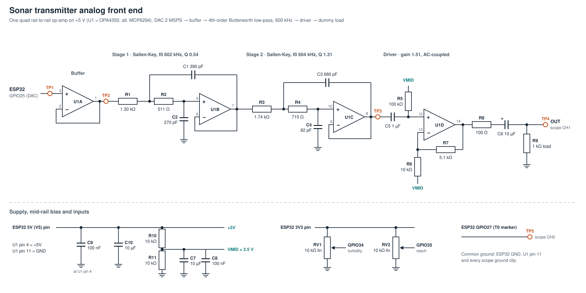

# Analog front end

Reconstruction filter and driver between the ESP32 DAC (GPIO25) and the transducer.
It turns the DAC's 2 MSPS staircase into a smooth pulse and drives a load, which is the
"analog signal conditioning" and "DAC and amplifier circuit" part of PS 26058.

| File | Contents |
|---|---|
| [schematic.svg](schematic.svg) | Circuit diagram |
| [bom.csv](bom.csv) | Bill of materials with E24 substitutes |
| [tools/make_schematic.py](tools/make_schematic.py) | Generates the SVG; edit and re-run to change it |

## How it works

One quad rail-to-rail op-amp on the ESP32's 5 V pin does everything:

| Block | Op-amp | Job |
|---|---|---|
| Buffer | U1A (unity gain) | Isolates the DAC pin, whose output impedance would otherwise shift the filter |
| Stage 1 | U1B, Sallen-Key | Low-pass, f0 602 kHz, Q 0.54 |
| Stage 2 | U1C, Sallen-Key | Low-pass, f0 604 kHz, Q 1.31. With stage 1: 4th-order Butterworth, fc 600 kHz |
| Driver | U1D, non-inverting | AC-coupled, biased at VMID = 2.5 V, gain 1 + R7/R6 = 1.51 (1.37 into the 1 kΩ load) |

The filter and DAC stages are DC-coupled and sit at the DAC's mid-scale (about 1.65 V).
The driver re-centres the signal on 2.5 V for the most swing on a 5 V supply, and C6 removes
the DC so the output idles at 0 V.

Filter response, from `python -m sonarscope.cli filter` and the same model with E24 parts:

| Frequency | E96 values | E24 substitutes |
|---|---|---|
| 100 kHz | −0.00 dB | −0.01 dB |
| 250 kHz | −0.01 dB | −0.05 dB |
| 487.3 kHz | −0.74 dB | −0.86 dB |
| 500 kHz | −0.89 dB | −1.01 dB |
| 1.5 MHz (first DAC image) | −31.7 dB | −31.5 dB |

With the DAC's own sample-and-hold roll-off, the 1.5 MHz image of a 500 kHz tone ends up
about −42 dB below the tone.

### Choosing the op-amp

At 500 kHz a full-scale pulse through the driver needs about 7.8 V/µs, and the Q = 1.31
stage needs a gain-bandwidth well above 600 kHz.

| Op-amp | GBW | Slew | Verdict |
|---|---|---|---|
| **OPA4350** (SOIC-14 + adapter) | 38 MHz | 22 V/µs | Use this: headroom at every setting |
| MCP6294 (PDIP-14, breadboard) | 10 MHz | 7 V/µs | Fine up to about 350 kHz at full amplitude; the 400–500 kHz band only at amplitude ≤ 0.7, or replace R7 with a wire (driver gain 1) |
| LM324, LM358, uA741 | ≤ 1.2 MHz | ≤ 0.6 V/µs | Do not use: the chirp comes out as triangles |
| TL072 / TL074 | 3 MHz | 13 V/µs | Avoid: not rail-to-rail, so little swing on 5 V, and marginal GBW for stage 2 |

## Netlist (for breadboarding)

U1 pins use the standard quad op-amp pinout: 1 OUTA, 2 −INA, 3 +INA, 4 V+, 5 +INB, 6 −INB,
7 OUTB, 8 OUTC, 9 −INC, 10 +INC, 11 V−, 12 +IND, 13 −IND, 14 OUTD.

| Node | Connects | Test point |
|---|---|---|
| DAC | ESP32 GPIO25, U1 pin 3 | TP1 |
| BUF | U1 pin 1, U1 pin 2, R1 | TP2 |
| X1 | R1, R2, C1 | |
| Y1 | R2, C2, U1 pin 5 | |
| S1 | U1 pin 7, U1 pin 6, C1, R3 | |
| X2 | R3, R4, C3 | |
| Y2 | R4, C4, U1 pin 10 | |
| S2 | U1 pin 8, U1 pin 9, C3, C5 | TP3 |
| B | C5, R5, U1 pin 12 | |
| N | U1 pin 13, R6, R7 | |
| DRV | U1 pin 14, R7, R8 | |
| M | R8, C6 (+) | |
| OUT | C6 (−), R9 | TP4 → scope CH1 |
| VMID | R10, R11, C7 (+), C8, R5, R6 | |
| +5V | ESP32 5V (V5) pin, U1 pin 4, C9, C10 (+), R10 | |
| 3V3 | ESP32 3V3 pin, one end of RV1 and of RV2 | |
| GND | ESP32 GND, U1 pin 11, C2, C4, C7 (−), C8, C9, C10 (−), R9, R11, other ends of RV1 and RV2, scope ground clips | |
| GPIO34 | RV1 wiper (turbidity) | |
| GPIO35 | RV2 wiper (reach) | |
| GPIO27 | T0 marker | TP5 → scope CH2 |

## Building it on a breadboard

1. Place U1 across the breadboard's centre gap, with C9 (100 nF) from pin 4 to pin 11 as close
   to the chip as it will go. Add C10 across the supply rails.
2. Build VMID (R10, R11, C7, C8) and check it before going further: about half the 5 V rail.
3. Build the buffer, then stage 1, then stage 2, then the driver, checking each stage as below.
4. Keep the filter parts' leads short. C1 and C3 go from the R-R junction to the op-amp
   **output**; C2 and C4 go from the **+ input** to ground. Swapping them wrecks the response.
5. Put C4 (82 pF) right at pin 10: two breadboard rows add a few pF, which is already 5 % of it.

## Bring-up, with expected readings

Firmware from [`firmware/`](../firmware/) on the ESP32, commands typed in the Serial Monitor.

| Step | Command | Probe | Expect |
|---|---|---|---|
| 1 | `IDLE` | multimeter | U1 pin 4: 4.7–5.0 V. VMID: half of that. TP1, TP2, TP3: about 1.65 V (DAC mid-scale). U1 pin 14: equal to VMID. TP4: 0 V |
| 2 | `PRESET tone_250k` | CH1 TP1, CH2 TP3 | 250 kHz on both. TP1 is stepped; TP3 is a smooth sine of the same amplitude |
| 3 | `PRESET tone_487k` | CH1 TP1, CH2 TP3, FFT on TP3 | TP3 slightly smaller (−0.7 dB). The 1.5 MHz image sits about 40 dB below the tone; an 8-bit scope's floor may hide it, which is a good sign |
| 4 | `PRESET tone_250k` | CH1 TP4 | Centred on 0 V, about 1.37 × the TP3 amplitude |
| 5 | `IDLE` | CH1 TP4, DC coupling | Within 20 mV of 0 V (the sonarscope `idle` criterion) |
| 6 | `PRESET lfm_hi`, then `DEMO` | CH1 TP4 | Clean chirp envelope; turning the pots changes band, length and amplitude |

If a stage misbehaves, compare its input and output test points before moving on.
Oscillation at a few MHz usually means a missing decoupling capacitor or long leads on the
stage 2 parts.

For the full measured test plan, probe TP4 and run `sonarscope suite` (see
[scope/README.md](../scope/README.md)).

## What this board is not

R9 is a dummy load. A real sonar transducer (piezo, tens to hundreds of volts at resonance)
needs a power amplifier and usually a matching transformer after TP4. That stage, and the
enclosure, are still to be designed.
